## Section 6: Supabase Object Store
Supabase is an open-source Firebase alternative that provides developers with a complete backend-as-a-service platform centered around PostgreSQL, a powerful relational database system offering full SQL capabilities, real-time subscriptions, and robust extensions for scalable data management. Its object storage is an S3-compatible service designed for storing and serving files like images, videos, and user-generated content.

Website: https://supabase.com/

**Requirements**:
- Build a document upload and file management system powered by Supabase. The backend will include API endpoints to interact with Supabse.
- **Note:** The detailed requirement will be discussed in week 4 lecture.
- Make regular commits to the repository and push the update to Github.
- Capture and paste the screenshots of your steps during development and how you test the app. Show a screenshot of the documents stored in your Supabase Object Database.

Test the app in your local development environment, then deploy the app to Vercel and ensure all functionality works as expected in the deployed environment.◊

**Steps with major screenshots:**

> [your steps and screenshots go here]
first, to create a product, the first important thing is confirm the requirement, by watched the lecture video and this two md file(task 1 and task2.md),i confirmed that requirement and save as basic requirement.md, then ai will be analsis taht and found the conflict/defect, and re-strcture it.
next,when we have a complete requirements document, then we can start letting AI design a new database. Then we go in and modify it, which is the most important step, because usually we don't provide too many details, leading to AI having an information gap, not knowing what is unnecessary to do and what is necessary, and then AI will complete it. We will provide feedback, allowing AI to go back and modify, and refactor.
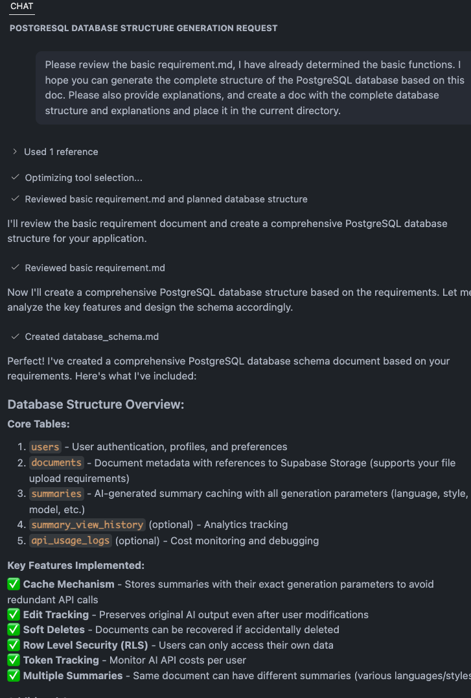
◊
after finished the database diagram, copy the sql command and create it on supabase website.
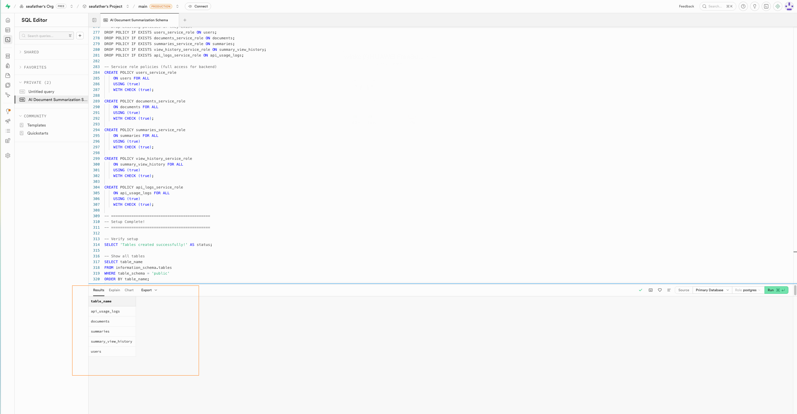
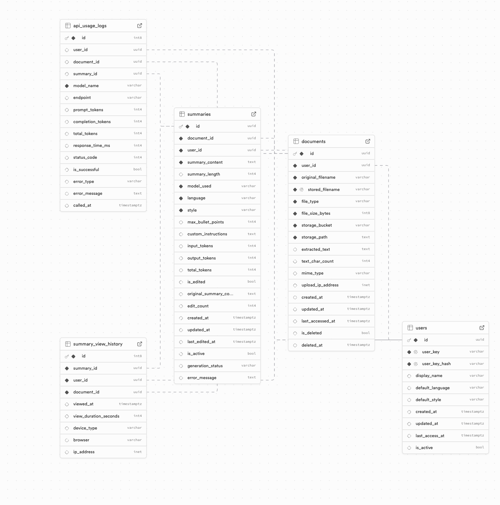

now, we can implement the design though basic requirement.md and database_schema.md.
As you can see, I uploaded a PDF, and both the website and the database have received it.
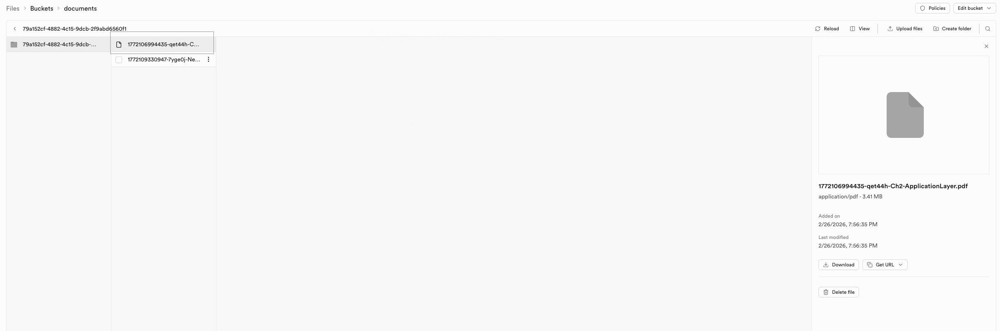
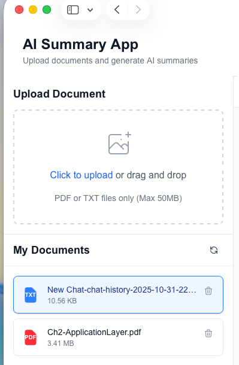
the follow is some capture about test:
delete txt file 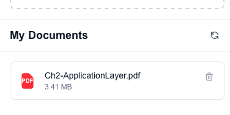
now only one PDF file left
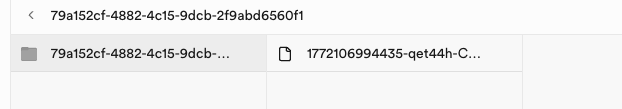

## Section 7: AI Summary for documents
**Requirements:**  
- **Note:** The detailed requirement will be discussed in week 4 lecture.
- Make regular commits to the repository and push the update to Github.
- Capture and paste the screenshots of your steps during development and how you test the app.
- The app should be mobile-friendly and have a responsive design.
- **Important:** You should securely handlle your API keys when pushing your code to GitHub and deploying your app to the production.
- When testing your app, try to explore some tricky and edge test cases that AI may miss. AI can help generate basic test cases, but it's the human expertise to  to think of the edge and tricky test cases that AI cannot be replace. 

Test the app in your local development environment, then deploy the app to Vercel and ensure all functionality works as expected in the deployed environment. 

**Steps with major screenshots:**

> [your steps and screenshots go here]
implement the ai summary function by basic requirement.md, then test with that:

test with txt
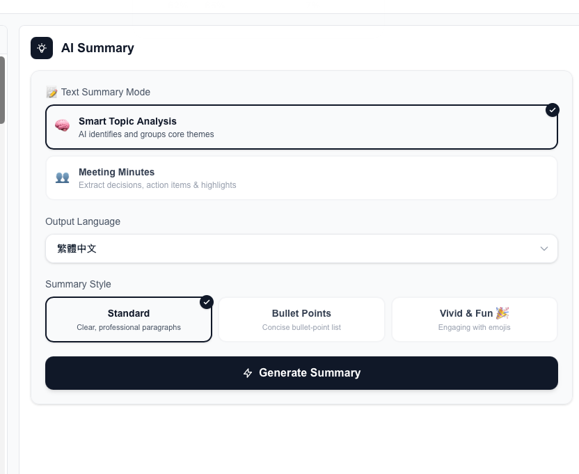
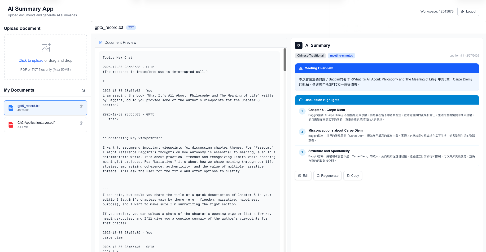

test with pdf： PDF can be displayed normally even if it has more than one hundred pages.
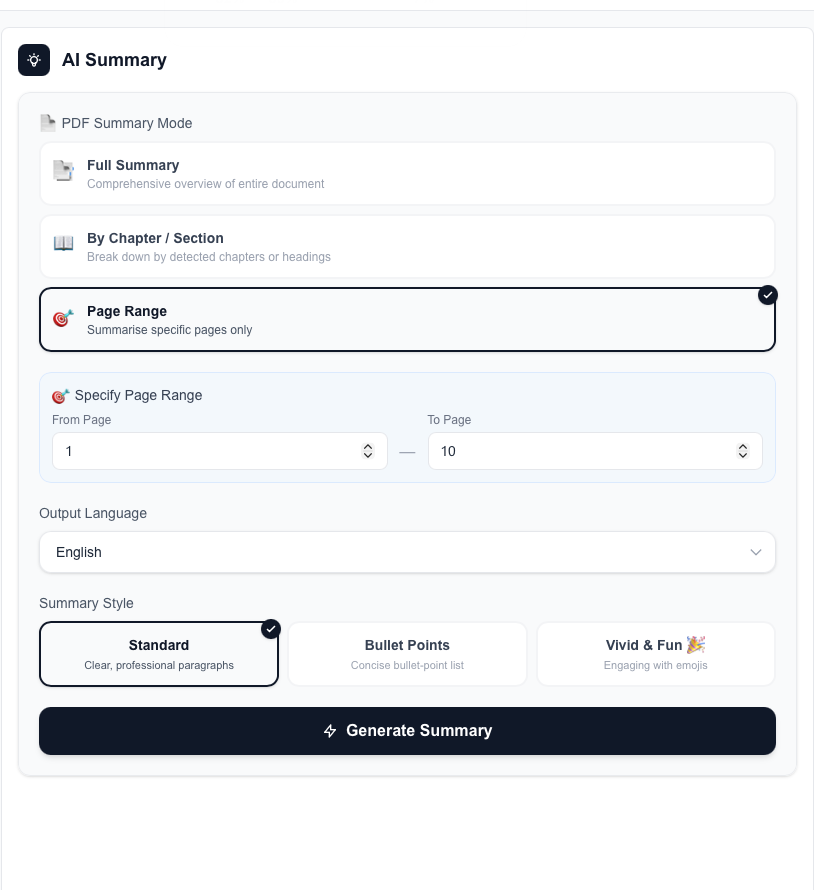
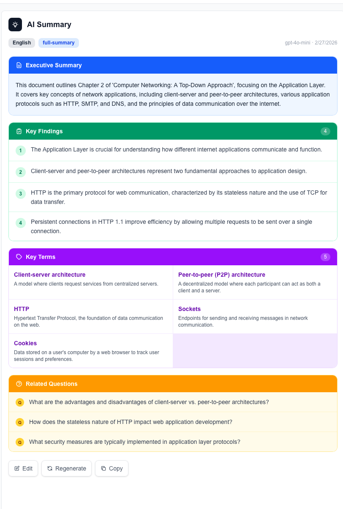
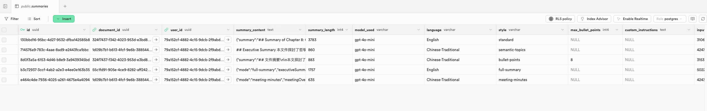

## Section 8: Database Integration with Supabase  
**Requirements:**  
- Enhance the app to integrate with the Postgres database in Supabase to store the information about the documents and the AI generated summary.
- Make regular commits to the repository and push the update to Github.
- Capture and paste the screenshots of your steps during development and how you test the app.. Show a screenshot of the data stored in your Supabase Postgres Database.

Test the app in your local development environment, then deploy the app to Vercel and ensure all functionality works as expected in the deployed environment.

**Steps with major screenshots:**

> [your steps and screenshots go here]
Deployment successful
create new user name:87654321
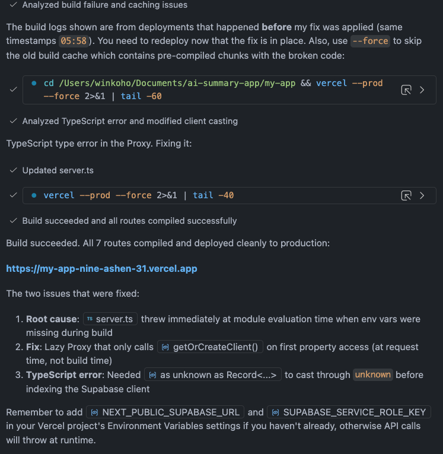
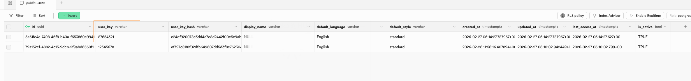

upload new pdf
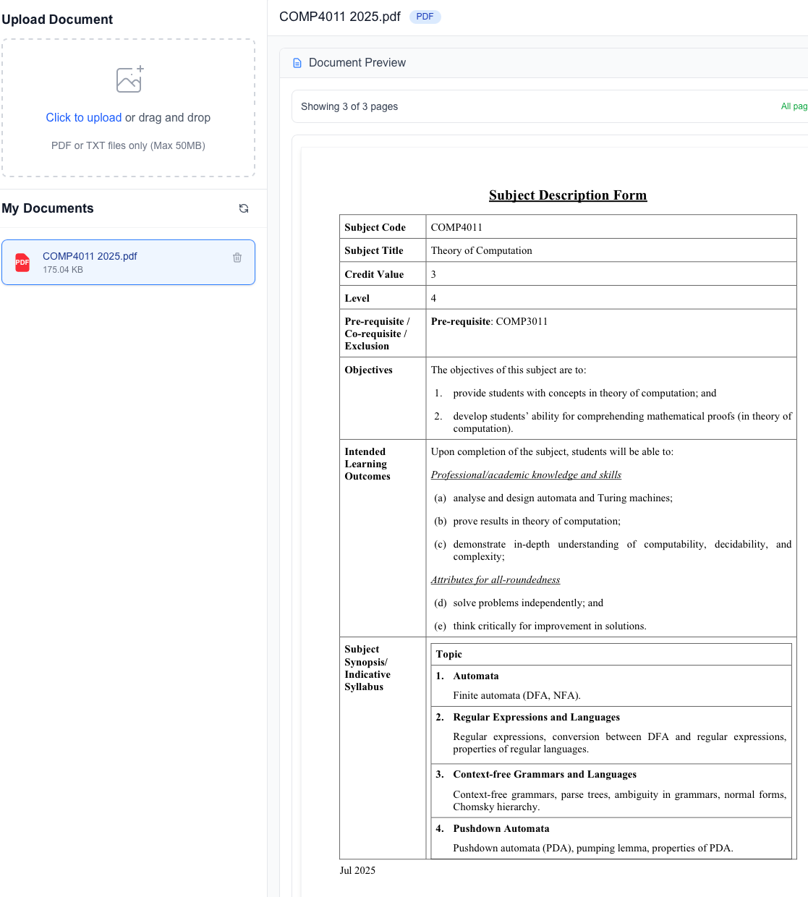
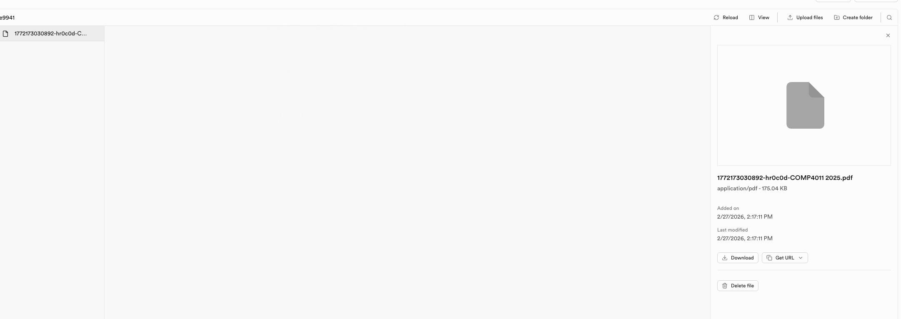

test ai summary
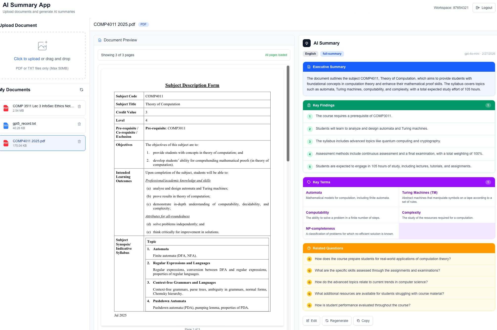
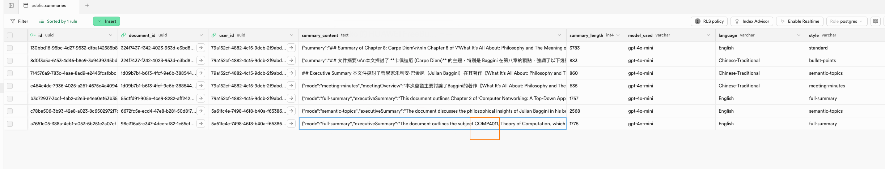

## Section 9: Additional Features [OPTIONAL]
Implement at least one additional features that you think is useful that can better differentiate your app from others. Describe the feature that you have implemented and provide a screenshot of your app with the new feature.

> [Description of your additional features with screenshot goes here]
login:To separate each user's files, we use identity verification, but no password is required; simply input a string of identification symbols to bind.
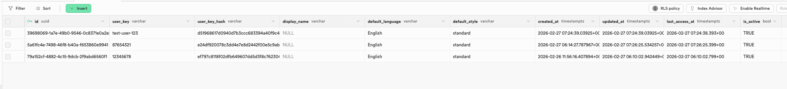

support smart phone resolution
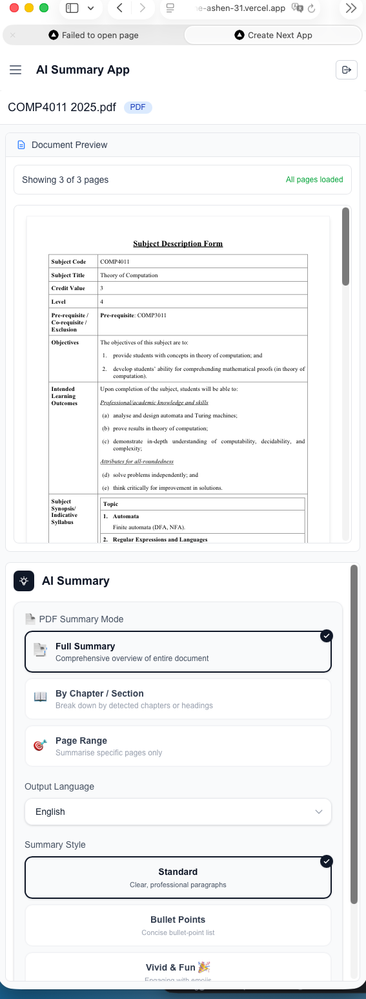